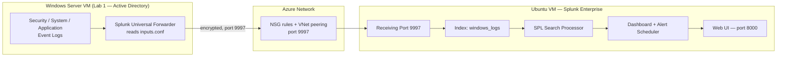
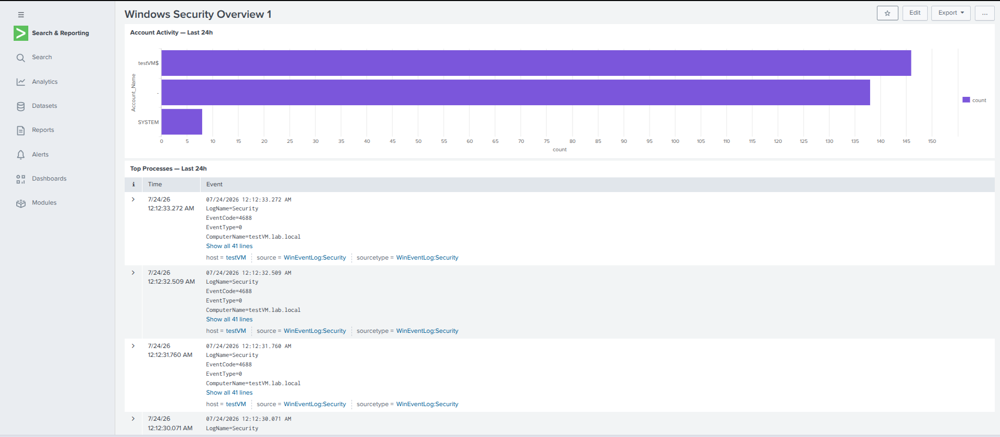
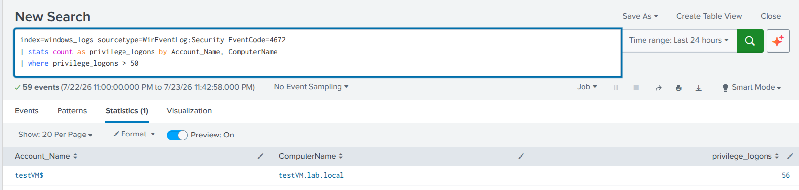

# Splunk SIEM & Log Analysis Lab

Hands-on SOC lab deploying Splunk Enterprise on Azure, forwarding Windows
Security/System/Application logs from an Active Directory server, and building
a working security dashboard and automated alert on top of that data.

**Tools:** Splunk Enterprise (free) · Splunk Universal Forwarder · Azure VMs (Windows Server 2025 + Ubuntu)
**Skill areas:** SIEM operations · SPL · log ingestion · security dashboarding · detection alerting
**Certification alignment:** CompTIA Security+ · CySA+ · Splunk Core Certified User

---

## The business problem this solves

A mid-sized organization generates millions of log events a day across
workstations, domain controllers, firewalls, and cloud services. Without a
central place to search all of it, a security team investigating an incident
has to log into each system separately and search manually — which is slow
exactly when speed matters most. A SIEM solves that by pulling every log
source into one searchable index, so an analyst can answer "what happened,
when, from where, and what was affected" in one place instead of five.

This lab builds that pipeline end to end: a Windows Server domain controller
forwards its Security, System, and Application logs to a Splunk instance,
which indexes them, surfaces them on a live dashboard, and fires an automated
alert when a detection condition is met. That's the core workflow behind every
SOC Analyst, Security Engineer, and Incident Responder role — and the same
correlation-and-alerting model carries directly into Microsoft Sentinel, AWS
Security Hub, or any other SIEM an employer happens to run.

---

## Architecture — how logs flow into Splunk



**Reading the flow:** Windows Event Logs are read by the **Universal
Forwarder**, which is configured via `inputs.conf` to watch the Security,
System, and Application logs. The forwarder compresses and encrypts that data
and ships it to the Splunk VM over **port 9997** — traffic that only crosses
the network boundary successfully once NSG rules and VNet peering are both in
place. On the Splunk side, incoming events land in the **`windows_logs`
index**, become searchable through **SPL**, and get surfaced two ways: a
**dashboard** for at-a-glance monitoring and a **scheduled alert** that fires
automatically when a detection condition is met — no analyst has to be
watching in real time for either to work.

> Renders automatically on GitHub — this is [Mermaid](https://mermaid.js.org/),
> not an image, so it stays in version control and stays editable.

---

## What's in this repository

| File | What it shows |
|------|---------------|
| `screenshots/windows-security-dashboard.png` | The full "Windows Security Overview" dashboard with all four panels populated |
| `screenshots/high-privileged-logon-alert.png` | The saved alert configuration for High Privileged Logon Count |
| `inputs.conf` | The forwarder configuration used to collect Security/System/Application logs into `windows_logs` |
| `spl-queries.txt` | The SPL searches used to build each dashboard panel and the alert |

> Add your actual screenshot files to a `screenshots/` folder in the repo using
> the filenames above (or update the paths here to match whatever you name
> them) — GitHub will render them inline automatically once they're committed.

---

## Security Dashboard — "Windows Security Overview"



| Panel | Search | Visualization |
|-------|--------|----------------|
| Account Activity — Last 24h | `index=windows_logs sourcetype=WinEventLog:Security EventCode=4624 \| stats count by Account_Name \| sort -count` | Bar chart |
| Top Processes — Last 24h | `index=windows_logs sourcetype=WinEventLog:Security EventCode=4688 \| stats count by Creator_Process_Name \| sort -count \| head 20` | Events list |
| Login Activity Over Time | `index=windows_logs sourcetype=WinEventLog:Security EventCode=4624 \| timechart count` | Line chart |
| After-Hours Logins | `index=windows_logs sourcetype=WinEventLog:Security EventCode=4624 \| eval hour=strftime(_time,"%H") \| where hour<7 OR hour>19 \| table _time, Account_Name, Account_Domain, ComputerName \| sort -_time` | Events list |

### What each panel shows and why it matters

The **Account Activity** panel counts successful logins (Event ID 4624) grouped
by account, which turns a flood of individual events into an immediate
visual answer to "who is actually logging in around here" — a spike from an
account that rarely logs in is often the first visible sign something's
off. **Top Processes** does the same for process creation events (4688),
surfacing which executables are running most often across the environment;
since attackers frequently rely on common built-in tools to blend in
("living off the land"), knowing the normal baseline here is what makes an
unfamiliar or unusual process name jump out later. **Login Activity Over
Time** plots logon volume as a trend line rather than a single number,
which matters because volume-based attacks — brute force attempts,
password spraying — show up as a shape on a timeline long before they'd be
obvious in a raw event list. **After-Hours Logins** filters successful
logons down to the hours outside a normal 7am–7pm workday; computer
accounts (ending in `$`) logging in overnight are routine, but a human
account authenticating at 3am is exactly the kind of anomaly a SOC analyst
is trained to chase down immediately, and this panel puts that list in
front of you without having to search for it manually.

---

## Automated Alert — "High Privileged Logon Count"



**Search:**
```spl
index=windows_logs sourcetype=WinEventLog:Security EventCode=4672
| stats count as privilege_logons by Account_Name, ComputerName
| where privilege_logons > 50
```

**Schedule:** Cron `*/15 * * * *` (every 15 minutes)
**Trigger condition:** Number of results > 0
**Trigger action:** Add to Triggered Alerts

### What this shows and why it matters

Event ID 4672 fires whenever an account is granted admin-level rights at
logon — so a high count of these events for one account on one machine in a
short window is a meaningful signal, not noise. Instead of a human having to
remember to check for that pattern, this alert runs the search itself every
15 minutes and logs a hit to Splunk's Triggered Alerts history the moment the
threshold is crossed. This is the actual mechanism behind real-world SOC
detection: rather than analysts staring at dashboards hoping to notice
something, the system watches continuously and only surfaces work when a
defined condition is actually met. The threshold (50) is a starting point,
not a fixed rule — tuning it against real false-positive rates over time is
part of the job, and that tuning process is exactly what separates a
detection that gets acted on from one that gets ignored due to alert fatigue.

---

## Steps to reproduce

### 1 — Deploy Splunk and enable receiving

1. Provision an Ubuntu 22.04 VM on Azure (`Standard_B2s`, 4GB RAM minimum, 30GB disk).
2. Open inbound NSG ports `8000` (web UI, restrict to your IP), `9997`
   (forwarder input, restrict to your VNet range), and `22` (SSH).
3. SSH in, then install and start Splunk:
   ```bash
   wget -O splunk-10.2.2-linux-amd64.deb "<current Splunk .deb URL>"
   sudo dpkg -i splunk-10.2.2-linux-amd64.deb
   sudo /opt/splunk/bin/splunk start --accept-license --run-as-root
   sudo /opt/splunk/bin/splunk enable boot-start
   ```
4. Log into `http://<VM-public-IP>:8000`, then **Settings → Forwarding and
   Receiving → Configure Receiving → New Receiving Port → 9997 → Save**.
5. **Settings → Indexes → Create New Index →** name it `windows_logs` **→ Save**.

### 2 — Forward logs from the Windows Server VM

1. On the Windows Server VM (Lab 1's domain controller), download and install
   the Universal Forwarder, pointing the Receiving Indexer field at the
   Splunk VM's **private** IP and port 9997.
2. Create `C:\Program Files\SplunkUniversalForwarder\etc\system\local\inputs.conf`
   with `[WinEventLog://Security]`, `[WinEventLog::System]`, and
   `[WinEventLog::Application]` stanzas, each set to `index = windows_logs`.
3. Restart the forwarder service: `Restart-Service SplunkForwarder`.
4. If the Windows VM and Splunk VM are in different VNets, configure VNet
   peering and add an NSG rule allowing port 9997 from the Windows VM's
   private IP before logs will arrive.

### 3 — Generate test data and confirm ingestion

1. Run the Lab 3 PowerShell log generator script (as Administrator) on the
   Windows Server VM to produce realistic failed logons, a successful login,
   service restarts, application events, and an account lockout.
2. Wait 60 seconds, then in Splunk run:
   ```spl
   index=windows_logs | head 100
   ```
   with the time range set to **All Time**. Confirm events appear.

### 4 — Build the dashboard

1. **Dashboards → Create New Dashboard →** title it `Windows Security
   Overview`, type **Classic Dashboard**.
2. Add one panel per row in the table above — new search, paste the SPL,
   choose the listed visualization, save.

### 5 — Create the alert

1. Run the privileged-logon search from the Alert section above in the
   search bar and confirm it returns results.
2. **Save As → Alert →** name it `High Privileged Logon Count`, set type
   **Scheduled**, cron `*/15 * * * *`, trigger condition **Number of
   Results > 0**, trigger action **Add to Triggered Alerts → Save**.
3. Confirm it's active under **Settings → Searches, Reports, and Alerts**.

---

## Key takeaways

- A SIEM's value isn't the data itself — it's collapsing scattered logs from
  every system into one place that's fast to search during an incident.
- Getting data in reliably (forwarder config, NSG rules, VNet peering) is
  usually the hardest part of a SIEM deployment, not writing the searches.
- A good security dashboard answers specific questions at a glance — who's
  logging in, what's running, is volume trending oddly, is anything happening
  outside normal hours — rather than just displaying raw data.
- Automated alerting is what turns detection from "hope someone notices" into
  a system that actively watches and only interrupts a human when a real
  condition is met.
