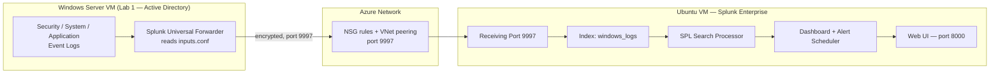
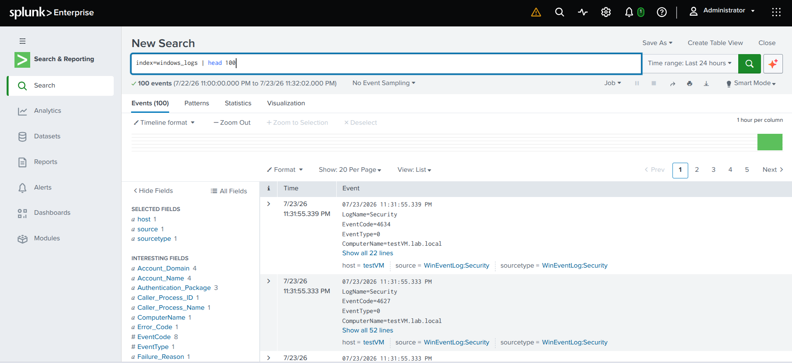
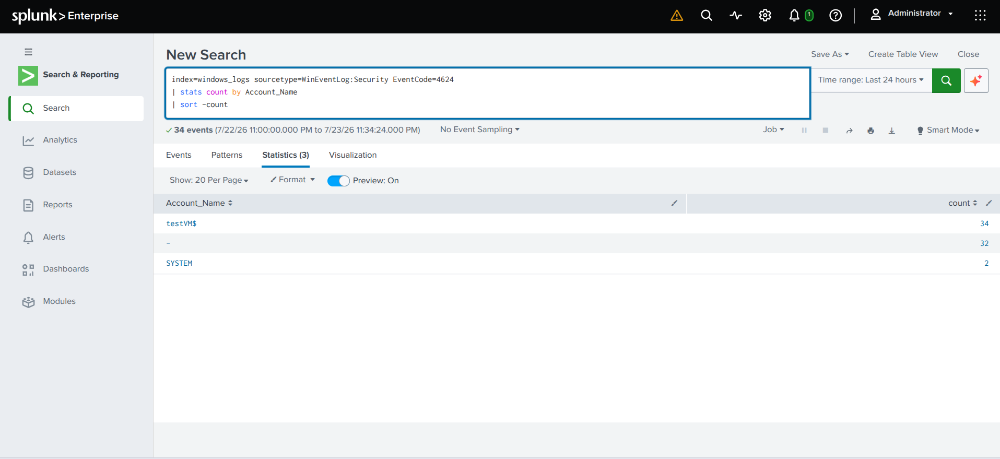
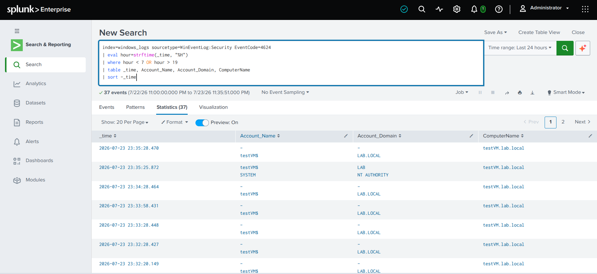
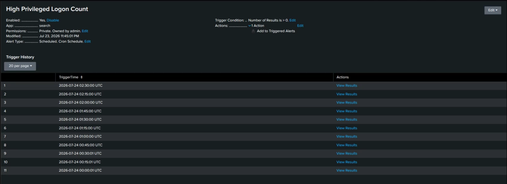
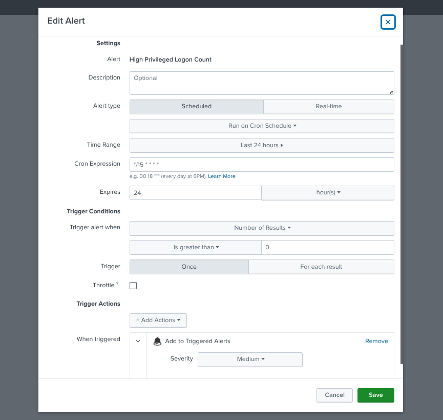

# Splunk SIEM & Log Analysis Lab

Hands-on SOC lab deploying Splunk Enterprise on Azure, forwarding Windows
Security/System/Application logs from an Active Directory server, and building
a working security dashboard and automated alert on top of that data.

**Tools:** Splunk Enterprise (free) · Splunk Universal Forwarder · Azure VMs (Windows Server 2025 + Ubuntu)
**Skill areas:** SIEM operations · SPL · log ingestion · security dashboarding · detection alerting
**Certification alignment:** CompTIA Security+ · CySA+ · Splunk Core Certified User

---

## WATCH THE LAB WALKTHROUGH HERE!
https://www.loom.com/share/46adb7efd15342bba8f3c076e60395cd

## The business problem this solves

A mid-sized organization generates millions of log events a day across
workstations, domain controllers, firewalls, and cloud services. Without a
central place to search all of it, a security team investigating an incident
has to log into each system separately and search manually — which is slow
exactly when speed matters most. A SIEM solves that by pulling every log
source into one searchable index, so an analyst can answer "what happened,
when, from where, and what was affected" in one place instead of five.

This lab builds that pipeline end to end: a Windows Server domain controller
forwards its Security, System, and Application logs to a Splunk instance,
which indexes them, surfaces them on a live dashboard, and fires an automated
alert when a detection condition is met. That's the core workflow behind every
SOC Analyst, Security Engineer, and Incident Responder role — and the same
correlation-and-alerting model carries directly into Microsoft Sentinel, AWS
Security Hub, or any other SIEM an employer happens to run.

---

## Architecture — how logs flow into Splunk



**Reading the flow:** Windows Event Logs are read by the **Universal
Forwarder**, which is configured via `inputs.conf` to watch the Security,
System, and Application logs. The forwarder compresses and encrypts that data
and ships it to the Splunk VM over **port 9997** — traffic that only crosses
the network boundary successfully once NSG rules and VNet peering are both in
place. On the Splunk side, incoming events land in the **`windows_logs`
index**, become searchable through **SPL**, and get surfaced two ways: a
**dashboard** for at-a-glance monitoring and a **scheduled alert** that fires
automatically when a detection condition is met — no analyst has to be
watching in real time for either to work.

> Renders automatically on GitHub — this is [Mermaid](https://mermaid.js.org/),
> not an image, so it stays in version control and stays editable.

---

## What's in this repository

| File | What it shows |
|------|---------------|
| `screenshots/windows-security-dashboard.png` | The full "Windows Security Overview" dashboard with all four panels populated |
| `screenshots/high-privileged-logon-alert.png` | The saved alert configuration for High Privileged Logon Count |
| `inputs.conf` | The forwarder configuration used to collect Security/System/Application logs into `windows_logs` |
| `spl-queries.txt` | The SPL searches used to build each dashboard panel and the alert |

> Add your actual screenshot files to a `screenshots/` folder in the repo using
> the filenames above (or update the paths here to match whatever you name
> them) — GitHub will render them inline automatically once they're committed.

---

## Security Dashboard — "Windows Security Overview"


| Panel | Search | Visualization |
|-------|--------|----------------|
| Account Activity — Last 24h | `index=windows_logs sourcetype=WinEventLog:Security EventCode=4624 \| stats count by Account_Name \| sort -count` | Bar chart |
| Top Processes — Last 24h | `index=windows_logs sourcetype=WinEventLog:Security EventCode=4688 \| stats count by Creator_Process_Name \| sort -count \| head 20` | Events list |
| Login Activity Over Time | `index=windows_logs sourcetype=WinEventLog:Security EventCode=4624 \| timechart count` | Line chart |
| After-Hours Logins | `index=windows_logs sourcetype=WinEventLog:Security EventCode=4624 \| eval hour=strftime(_time,"%H") \| where hour<7 OR hour>19 \| table _time, Account_Name, Account_Domain, ComputerName \| sort -_time` | Events list |

### What each panel shows and why it matters

The **Account Activity** panel counts successful logins (Event ID 4624) grouped
by account, which turns a flood of individual events into an immediate
visual answer to "who is actually logging in around here" — a spike from an
account that rarely logs in is often the first visible sign something's
off. **Top Processes** does the same for process creation events (4688),
surfacing which executables are running most often across the environment;
since attackers frequently rely on common built-in tools to blend in
("living off the land"), knowing the normal baseline here is what makes an
unfamiliar or unusual process name jump out later. **Login Activity Over
Time** plots logon volume as a trend line rather than a single number,
which matters because volume-based attacks — brute force attempts,
password spraying — show up as a shape on a timeline long before they'd be
obvious in a raw event list. **After-Hours Logins** filters successful
logons down to the hours outside a normal 7am–7pm workday; computer
accounts (ending in `$`) logging in overnight are routine, but a human
account authenticating at 3am is exactly the kind of anomaly a SOC analyst
is trained to chase down immediately, and this panel puts that list in
front of you without having to search for it manually.

---

## Automated Alert — "High Privileged Logon Count"


**Search:**
```spl
index=windows_logs sourcetype=WinEventLog:Security EventCode=4672
| stats count as privilege_logons by Account_Name, ComputerName
| where privilege_logons > 50
```

**Schedule:** Cron `*/15 * * * *` (every 15 minutes)
**Trigger condition:** Number of results > 0
**Trigger action:** Add to Triggered Alerts

### What this shows and why it matters

Event ID 4672 fires whenever an account is granted admin-level rights at
logon — so a high count of these events for one account on one machine in a
short window is a meaningful signal, not noise. Instead of a human having to
remember to check for that pattern, this alert runs the search itself every
15 minutes and logs a hit to Splunk's Triggered Alerts history the moment the
threshold is crossed. This is the actual mechanism behind real-world SOC
detection: rather than analysts staring at dashboards hoping to notice
something, the system watches continuously and only surfaces work when a
defined condition is actually met. The threshold (50) is a starting point,
not a fixed rule — tuning it against real false-positive rates over time is
part of the job, and that tuning process is exactly what separates a
detection that gets acted on from one that gets ignored due to alert fatigue.

---

## Step 1 — Get Splunk Free

Splunk Enterprise is free to download, with a 60-day full trial that converts
automatically to the free license afterward — capped at 500MB/day of
indexing, more than enough for a home lab.

### Create a Splunk account

Splunk requires an account and a registration form before downloading. A
temporary email address works fine for this — no need to use real personal
details:

1. Go to `temp-mail.org/en/` — a temporary email address is generated
   automatically, no sign-up required.
2. Paste that address into the Splunk registration form's Email field; fill
   the rest (Name, Company, Job Title, Phone) with any placeholder info.
3. Splunk sends a confirmation email — it appears in the temp-mail inbox
   within a minute. Click the confirmation link to activate the account.

### Deploy on an Azure VM

| VM Setting | Value |
|------------|-------|
| OS | Ubuntu 22.04 LTS (free tier eligible) |
| Size | `Standard_B2s` (2 vCPU, 4GB RAM — Splunk's minimum) |
| Disk | 30GB minimum |
| Inbound NSG ports | `8000` (Splunk web UI) · `9997` (forwarder input) · `22` (SSH) |

Restrict ports `8000` and `22` to your own IP address only, and restrict
`9997` to the VNet address range only (e.g. `10.0.0.0/16`) — so only other
VMs on the network can forward logs in, not the public internet.

### SSH into the Linux VM

Mac and Linux both have SSH built in — no extra tools needed.

**Fix the key file permissions first.** A `.pem` key downloaded from Azure
arrives with permissions that are too open; SSH refuses to use it until
they're locked down:

```bash
cd ~/Downloads
chmod 400 yourkey.pem
```

Skipping this step produces an `UNPROTECTED PRIVATE KEY FILE` warning and a
denied connection.

**Then connect:**

```bash
ssh -i yourkey.pem azureuser@YOUR_VM_PUBLIC_IP
```

Replace `azureuser` with the admin username set when the VM was created, and
`YOUR_VM_PUBLIC_IP` with the current public IP from the Azure portal. Accept
the host fingerprint prompt (`yes`), then enter the password.

### Install Splunk

Each command below runs over that SSH session, in order.

**1 — Download the installer:**
```bash
wget -O splunk-10.2.2-linux-amd64.deb "https://download.splunk.com/products/splunk/releases/10.2.2/linux/splunk-10.2.2-80b90d638de6-linux-amd64.deb"
```
If this 404s, Splunk has released a newer version — log into splunk.com, go
to Free Trials and Downloads, select the Linux `.deb`, and copy the current
`wget` command from the download page.

**2 — Install the package:**
```bash
sudo dpkg -i splunk-10.2.2-linux-amd64.deb
```
This unpacks Splunk into `/opt/splunk/`. A warning about a missing Python 3.7
path is expected and harmless on Ubuntu 22.04 — Splunk 10.x ships its own
Python.

**3 — Start Splunk and accept the license:**
```bash
sudo /opt/splunk/bin/splunk start --accept-license --run-as-root
```
This is where the admin username and password for the web UI get set —
you'll be prompted for them interactively.

**4 — Enable Splunk to start on boot:**
```bash
sudo /opt/splunk/bin/splunk enable boot-start
```
Without this, Splunk needs to be started manually over SSH every time the VM
restarts.

### Access the web UI

```
http://<YOUR_VM_PUBLIC_IP>:8000
```

### If the browser shows "This site can't be reached"

A timeout on port 8000 is almost always a missing NSG rule. Work through
these checks in order:

1. **Add the port 8000 NSG rule** (most common cause) — Azure Portal → VM →
   **Networking** → **Inbound port rules**. If no rule allows port 8000, add
   one: Name `Allow-SplunkWebUI-MyIP`, Source `My IP address`, Destination
   port `8000`, Protocol `TCP`, Action `Allow`, Priority `310`.
2. **Confirm Splunk is running:**
   ```bash
   sudo /opt/splunk/bin/splunk status
   ```
   If it says stopped: `sudo /opt/splunk/bin/splunk start --accept-license --run-as-root`.
3. **Confirm Splunk is listening on port 8000:**
   ```bash
   sudo ss -tlnp | grep 8000
   ```
   Expect a line showing `0.0.0.0:8000` with `splunkd` in the process
   column. Nothing returned means Splunk isn't running; a line returned but
   the browser still fails points back to the NSG rule.
4. **Confirm the current public IP** — Azure Portal → VM → **Overview**.
   Azure reassigns the public IP on stop/restart unless it's set to Static,
   so always pull the current one from the portal rather than a saved
   bookmark.
5. **Add the port 9997 inbound rule** for the forwarder — Source
   `IP Addresses`, Source IP = the Windows VM's private IP, Destination port
   `9997`, Protocol `TCP`, Action `Allow`, Priority `320`.
6. **Set up VNet Peering** if the Windows Server VM and Splunk VM live in
   different VNets — NSG rules alone don't let two separate VNets talk to
   each other; peering creates the private connection between them. Name the
   peering links descriptively (e.g. `splunk-vnet-to-ad-vnet` /
   `ad-vnet-to-splunk-vnet`), and wait for both links to show **Connected**
   before testing. Afterward, restart the forwarder on the Windows VM:
   `Restart-Service SplunkForwarder`.

**Best practice for future labs:** put every lab VM in one shared VNet from
the start, each in its own subnet (e.g. `10.0.1.0/24` for AD, `10.0.2.0/24`
for Splunk) — VMs in the same VNet communicate freely with only NSG rules to
manage, no peering required.

**To stop the public IP from changing between sessions:** VM →
**Networking** → the public IP resource → **Configuration** → set
**Assignment** to **Static**.

---

## Step 2 — Configure Data Inputs

### Part A — Enable receiving in Splunk

1. Log into the Splunk web UI.
2. **Settings → Forwarding and Receiving → Configure Receiving → New
   Receiving Port** → enter `9997` → **Save**.
3. **Settings → Indexes → Create New Index** → name it `windows_logs` →
   **Save**.

### Part B — Install the Universal Forwarder on the Windows Server

Done on the Windows Server VM from Lab 1 — not the Splunk Ubuntu VM.

1. On the Windows Server VM, go to
   `splunk.com/en_us/download/universal-forwarder.html` and log in with the
   same Splunk account used for the Enterprise download.
2. Download the **Windows 64-bit** installer — the page also lists 32-bit
   and ARM options; the 64-bit one is correct.
3. Run the installer. When asked for a **Deployment Server**, leave it
   blank — setting it to the Splunk VM's IP causes the forwarder to phone
   home to the wrong address and no data flows.
4. When asked for a **Receiving Indexer**, enter the Splunk VM's **private**
   IP and port `9997` (e.g. `10.2.0.4:9997`).
5. Finish the install with default settings.

### Part C — Configure inputs.conf

`inputs.conf` tells the forwarder exactly which logs to collect. File
location:
```
C:\Program Files\SplunkUniversalForwarder\etc\system\local\inputs.conf
```
(Create the `local` folder first if it doesn't already exist.) VS Code is the
easiest tool for editing this — install it on the Windows VM from
`code.visualstudio.com`, then run it **as Administrator** so it can save
into `Program Files`.

```ini
# File location on Windows Server VM:
# C:\Program Files\SplunkUniversalForwarder\etc\system\local\inputs.conf

[WinEventLog://Security]
# The Security log contains all authentication events — logins, failures, lockouts
disabled = 0
start_from = oldest
current_only = 0
evt_resolve_ad_obj = 1
index = windows_logs

[WinEventLog://System]
# System log contains OS-level events — service starts/stops, driver failures
disabled = 0
index = windows_logs

[WinEventLog://Application]
# Application log contains events from installed applications
disabled = 0
index = windows_logs
```

After saving, restart the forwarder in an Administrator PowerShell:
```powershell
Restart-Service SplunkForwarder
```

> **Note:** Splunk ships with built-in sample data. **Search → Data
> Summary** surfaces sample indexes if you want to practice SPL before your
> own forwarder data is flowing.

---

## Step 2D — Generate Test Log Data

A fresh Windows Server VM has mostly empty Security/System/Application logs.
This PowerShell script (run as Administrator on the Windows Server VM)
simulates realistic activity — failed logins, a successful login, service
restarts, application warnings, and an account lockout — by creating a
temporary local account, generating login activity against it, and then
deleting it. Nothing is changed permanently on the VM.

```powershell
# ============================================================
# Lab 3 Log Generator - Run as Administrator on the Windows VM
# Output saved to C:\lab3-log-output.txt
# ============================================================

$logFile = 'C:\lab3-log-output.txt'
$timestamp = Get-Date -Format 'yyyy-MM-dd HH:mm:ss'

function Log($message, $color = 'White') {
    Write-Host $message -ForegroundColor $color
    Add-Content -Path $logFile -Value "[$timestamp] $message"
}

if (Test-Path $logFile) { Remove-Item $logFile }
Add-Content -Path $logFile -Value "Lab 3 Log Generator - Run started at $timestamp"
Add-Content -Path $logFile -Value '============================================='

Log 'Starting log generation...' Green

$testUser = 'labtest.user'
$testPass = ConvertTo-SecureString 'TempPass123!' -AsPlainText -Force
New-LocalUser -Name $testUser -Password $testPass -Description 'Splunk lab test account' -ErrorAction SilentlyContinue
Log "Created test user: $testUser" Gray

Log 'Generating failed logon attempts (Security log activity)...' Yellow
$wrongPass = ConvertTo-SecureString 'WrongPassword!' -AsPlainText -Force
1..15 | ForEach-Object {
    $cred = New-Object System.Management.Automation.PSCredential($testUser, $wrongPass)
    Start-Process -FilePath 'cmd.exe' -Credential $cred -ArgumentList '/c exit' -ErrorAction SilentlyContinue
    Start-Sleep -Milliseconds 500
}
Log '  Generated 15 failed logon attempts' Gray

Log 'Generating successful login event (4624)...' Yellow
$correctPass = ConvertTo-SecureString 'TempPass123!' -AsPlainText -Force
$cred = New-Object System.Management.Automation.PSCredential($testUser, $correctPass)
Start-Process -FilePath 'cmd.exe' -Credential $cred -ArgumentList '/c whoami' -Wait -ErrorAction SilentlyContinue
Log '  Generated successful login (Event ID 4624)' Gray

Log 'Generating service events (7036)...' Yellow
$services = @('Spooler','Schedule','Netlogon')
$services | ForEach-Object {
    Stop-Service -Name $_ -Force -ErrorAction SilentlyContinue
    Start-Sleep -Seconds 2
    Start-Service -Name $_ -ErrorAction SilentlyContinue
    Start-Sleep -Seconds 1
    Log "  Stopped and restarted service: $_" Gray
}

Log 'Generating application log events...' Yellow
$eventSource = 'SplunkLabTest'
if (-not [System.Diagnostics.EventLog]::SourceExists($eventSource)) {
    New-EventLog -LogName Application -Source $eventSource -ErrorAction SilentlyContinue
}
1..5 | ForEach-Object {
    Write-EventLog -LogName Application -Source $eventSource -EventId 1001 `
        -EntryType Warning -Message 'Splunk lab test event - application warning'
    Start-Sleep -Milliseconds 300
}
Log '  Generated 5 application log entries (Event ID 1001)' Gray

Log 'Generating account lockout event (4740)...' Yellow
$badCred = ConvertTo-SecureString 'BadPass!' -AsPlainText -Force
1..20 | ForEach-Object {
    $cred = New-Object System.Management.Automation.PSCredential($testUser, $badCred)
    Start-Process -FilePath 'cmd.exe' -Credential $cred -ArgumentList '/c exit' -ErrorAction SilentlyContinue
    Start-Sleep -Milliseconds 200
}
Log '  Account lockout triggered (Event ID 4740)' Gray

Start-Sleep -Seconds 3
Remove-LocalUser -Name $testUser -ErrorAction SilentlyContinue
Log "Removed test user: $testUser" Gray

Log 'Restarting forwarder to ship events to Splunk...' Yellow
Restart-Service SplunkForwarder -ErrorAction SilentlyContinue
Log '  SplunkForwarder restarted' Gray

$endTime = Get-Date -Format 'yyyy-MM-dd HH:mm:ss'
Add-Content -Path $logFile -Value '============================================='
Add-Content -Path $logFile -Value "Run completed at $endTime"
Add-Content -Path $logFile -Value 'Wait 60 seconds then run: index=windows_logs | head 100'
```

After it finishes, wait 60 seconds for the forwarder to ship events, set the
Splunk time range to **All Time**, and run:
```spl
index=windows_logs | head 100
```
Events from Security, System, and Application should appear.

---

## Step 3 — Essential SPL Searches

All searches run in the Search & Reporting app's search bar, with a time
range selected on the right.

**Confirm data is flowing:**
```spl
index=windows_logs | head 100
```
Returns nothing → check that `SplunkForwarder` is running on the Windows VM.



**Find successful logins (EventCode 4624):**
```spl
index=windows_logs sourcetype=WinEventLog:Security EventCode=4624
| stats count by Account_Name
| sort -count
```



**Detect after-hours logins:**
```spl
index=windows_logs sourcetype=WinEventLog:Security EventCode=4624
| eval hour=strftime(_time, "%H")
| where hour < 7 OR hour > 19
| table _time, Account_Name, Account_Domain, ComputerName
| sort -_time
```
Account names ending in `$` are computer accounts and expected overnight; a
human account authenticating after hours warrants review.



---

## Step 4 — Build a Security Dashboard

1. **Dashboards → Create New Dashboard.**
2. Title it `Windows Security Overview`, leave Description blank,
   Permissions Private, type **Classic Dashboards → Create → Create
   Dashboard**.
3. Click **Add Panel** for each row in the panel table above — New Search,
   paste the SPL, choose the listed visualization, save.

The full panel table, screenshot, and explanation of what each panel shows
are in the [Security Dashboard](#security-dashboard--windows-security-overview)
section above.

---

## Step 5 — Create an Automated Alert

1. Run the privileged-logon search (in the
   [Automated Alert](#automated-alert--high-privileged-logon-count) section
   above) in the search bar first to confirm it works.

   
2. **Save As → Alert.**
3. Name: `High Privileged Logon Count`. Alert type: **Scheduled**. Run every
   15 minutes via **Cron Schedule**: `*/15 * * * *`.
4. Trigger condition: **Number of Results is greater than 0**.
5. Trigger action: **Add to Triggered Alerts** — logs each firing to
   **Activity → Triggered Alerts** with a timestamp and result count, no
   email or ticketing integration required.
6. **Save.**



An alert that fires too broadly creates alert fatigue; one that's too narrow
misses real threats — the threshold here is a starting point to tune against
real false-positive rates over time.

---

## Verification — confirm the lab is working

| Check | How to verify |
|-------|---------------|
| Data is flowing into Splunk | `index=windows_logs \| head 10` returns recent events |
| Login activity search works | The EventCode=4624 search returns results immediately |
| Dashboard displays data | Windows Security Overview dashboard shows populated panels |
| Alert is active | **Settings → Searches, Reports, and Alerts** shows the alert as Enabled |

---

## Key takeaways

- A SIEM's value isn't the data itself — it's collapsing scattered logs from
  every system into one place that's fast to search during an incident.
- Getting data in reliably (forwarder config, NSG rules, VNet peering) is
  usually the hardest part of a SIEM deployment, not writing the searches.
- A good security dashboard answers specific questions at a glance — who's
  logging in, what's running, is volume trending oddly, is anything happening
  outside normal hours — rather than just displaying raw data.
- Automated alerting is what turns detection from "hope someone notices" into
  a system that actively watches and only interrupts a human when a real
  condition is met.
